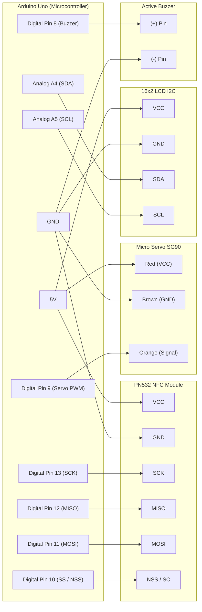

# Parking system
> Sistem gerbang parkir cerdas berbasis IoT menggunakan Arduino Uno, modul NFC, dan kontrol servo otomatis untuk akses masuk yang aman dan efisien.

[](https://opensource.org/licenses/MIT)
[](https://github.com/topics/iot)
[](https://github.com/topics/arduino)
[](https://github.com/saecar/parking-system)

---

## 🌟 Fitur Utama

- **Autentikasi Kartu NFC/RFID**: Menggunakan modul Elechouse NFC V3 (PN532) dengan komunikasi Hardware SPI untuk pembacaan UID kartu yang cepat dan akurat.
- **Kontrol Palang Pintar (Servo)**: Pergerakan motor servo Micro SG90 secara halus (*smooth movement*) saat akses diberikan maupun ditutup kembali.
- **Indikator Visual & Audio**: Dilengkapi LCD 16x2 I2C untuk menampilkan status sistem secara real-time dan Buzzer piezo untuk umpan balik suara interaktif (akses diterima, ditolak, atau waktu hitung mundur).
- **Sistem Keamanan Anti-Brute Force**: Mekanisme penguncian otomatis sementara (*lockout*) jika terjadi kesalahan pemindaian kartu sebanyak 3 kali berturut-turut.
- **Auto-Relock Timer**: Palang parkir akan menutup secara otomatis setelah jeda waktu tertentu pasca kendaraan melintas.

---

## 🛠 Tech Stack & Komponen

### Bill of Materials (BOM)
| Komponen | Jumlah | Fungsi Utama |
| :--- | :---: | :--- |
| **Arduino Uno (ATmega328P)** | 1 | Mikrokontroler pusat pemrosesan logika sistem |
| **NFC Module V3 (PN532)** | 1 | Modul pembaca kartu/tag RFID/NFC (SPI Mode) |
| **Micro Servo SG90** | 1 | Penggerak mekanis palang pintu parkir |
| **16x2 LCD Display + I2C Backpack** | 1 | Layar informasi status sistem (SDA/SCL) |
| **Active Buzzer** | 1 | Indikator suara peringatan dan konfirmasi |
| **Breadboard & Jumper Wires** | Secukupnya | Media perangkaian sirkuit elektronik |

### Diagram Wiring Interaktif


### Tabel Pinout Lengkap
| Komponen | Pin Modul / Sensor | Pin Arduino Uno | Level Tegangan | Keterangan |
| :--- | :--- | :--- | :--- | :--- |
| **PN532 NFC** | VCC | 5V | 5V | Catu daya modul |
| | GND | GND | 0V | Ground bersama |
| | SCK | Pin 13 | 5V | SPI Serial Clock |
| | MISO | Pin 12 | 5V | SPI Master In Slave Out |
| | MOSI | Pin 11 | 5V | SPI Master Out Slave In |
| | SS (NSS) | Pin 10 | 5V | SPI Slave Select |
| **Micro Servo** | Signal (Orange) | Pin 9 (PWM) | 5V | Kontrol sudut lengan servo |
| | VCC (Red) | 5V | 5V | Catu daya motor servo |
| | GND (Brown) | GND | 0V | Ground bersama |
| **LCD 16x2 I2C** | SDA | Analog A4 | 5V | I2C Data Line |
| | SCL | Analog A5 | 5V | I2C Clock Line |
| **Buzzer** | Positive (+) | Pin 8 | 5V | Output sinyal nada/alarm |

---

## 🚀 Cara Pemasangan & Persiapan

Ikuti langkah-langkah di bawah ini untuk merakit dan mengunggah kode sumber ke perangkat Arduino Uno:

### 1. Kloning Repositori
Buka terminal pada komputer Anda dan jalankan perintah berikut:
```bash
git clone https://github.com/saecar/parking-system.git
cd parking-system
```

### 2. Instalasi Dependensi & Library
Pastikan Anda menggunakan **Arduino IDE** atau **PlatformIO**. Instal library pendukung berikut melalui *Library Manager* Arduino IDE:
- `SPI.h` (Bawaan Arduino)
- `Wire.h` (Bawaan Arduino)
- `Servo` (oleh Michael Margolis)
- `Adafruit PN532` (oleh Adafruit)
- `LiquidCrystal_I2C` (oleh Frank de Brabander)

### 3. Konfigurasi Perangkat Keras
1. Rangkai komponen di atas *breadboard* sesuai dengan **Tabel Pinout** dan **Diagram Wiring** di atas.
2. Pastikan sambungan kabel jumper kuat dan tidak ada arus pendek (*short circuit*) pada jalur daya 5V dan GND.

### 4. Unggah Firmware
1. Hubungkan Arduino Uno ke komputer menggunakan kabel USB.
2. Buka berkas `.ino` utama melalui Arduino IDE.
3. Pilih board yang sesuai:
   - **Board**: `Arduino Uno`
   - **Port**: Pilih port COM yang terdeteksi (contoh: `COM3` atau `/dev/ttyUSB0`)
4. Klik tombol **Upload** (panah kanan) pada Arduino IDE.

---

## 📂 Struktur Folder

```text
parking-system/
├── secure_door.ino         # Kode sumber utama firmware mikrokontroler
├── assets/                 # Direktori aset dokumentasi (skema, gambar)
├── .gitignore              # Berkas pengecualian Git
└── README.md               # Dokumentasi resmi proyek (Panduan & Spesifikasi)
```

---

## 🤝 Kontribusi & Lisensi

Kontribusi, laporan bug, dan permintaan fitur sangat dipersilakan! Silakan buat *Pull Request* atau buka *Issue* baru pada repositori ini.

Proyek ini dilisensikan di bawah lisensi **MIT** - lihat berkas [LICENSE](LICENSE) untuk detail lebih lanjut.