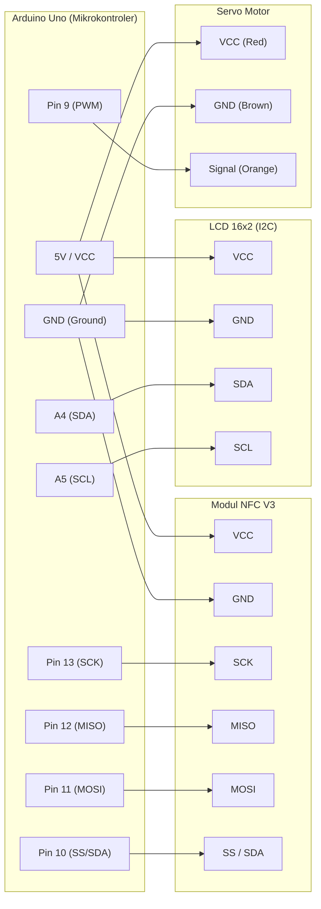

# parking-system

> Sistem parkir otomatis berbasis IoT menggunakan Arduino Uno dan modul NFC untuk manajemen akses gerbang yang aman, efisien, dan real-time.

<div align="center">

[](https://opensource.org/licenses/MIT)
[](https://github.com/topics/iot)
[](https://www.arduino.cc/)
[](https://github.com/saecar/parking-system)

</div>

---

## 🌟 Fitur Utama

- 💳 **Autentikasi Kartu NFC:** Validasi akses masuk dan keluar menggunakan teknologi RFID/NFC (Modul NFC V3) dengan tingkat keamanan tinggi.
- 🚧 **Kontrol Otomatis Palang Parkir:** Mekanisme penggerak berbasis Servo Motor yang membuka dan menutup gerbang secara otomatis saat kartu terverifikasi.
- 📺 **Informasi Real-Time LCD:** Menampilkan status sistem, sisa slot parkir, dan pesan sapaan/peringatan secara langsung melalui layar LCD 16x2 I2C.
- 🔄 **Sistem Terintegrasi IoT:** Memantau status ketersediaan lahan parkir dan log transaksi akses melalui konektivitas jaringan mikrokontroler.

---

## 🛠 Tech Stack & Komponen

### Bill of Materials (BoM) / Daftar Komponen Hardware

| Komponen | Jumlah | Keterangan / Fungsi |
| :--- | :---: | :--- |
| **Arduino Uno (ATmega328P)** | 1 pcs | Mikrokontroler utama pengolah logika sistem |
| **Modul NFC V3 (PN532 / RFID)** | 1 pcs | Pembaca kartu akses (Smart Card Reader) |
| **Servo Motor (SG90 / MG996R)** | 1 pcs | Penggerak mekanis palang pintu parkir |
| **LCD 16x2 with I2C Module** | 1 pcs | Display antarmuka informasi visual |
| **Breadboard & Kabel Jumper** | Secukupnya | Media penghubung rangkaian elektronik |
| **Power Supply / Adaptor 5V** | 1 pcs | Sumber daya stabil untuk aktuator dan modul |

---

## ⚡ Diagram Wiring & Pinout

### Diagram Rangkaian (Mermaid)



### Tabel Pinout Lengkap

| Komponen / Sensor | Pin pada Modul | Pin Arduino Uno | Level Tegangan | Keterangan / Fungsi |
| :--- | :--- | :--- | :--- | :--- |
| **Modul NFC V3** | VCC | 5V | 5V | Catu daya modul NFC |
| | GND | GND | 0V | Ground bersama |
| | SCK | Pin 13 | 5V | SPI Serial Clock |
| | MISO | Pin 12 | 5V | SPI Master In Slave Out |
| | MOSI | Pin 11 | 5V | SPI Master Out Slave In |
| | SS / SDA | Pin 10 | 5V | SPI Slave Select |
| **LCD 16x2 (I2C)** | VCC | 5V | 5V | Catu daya modul I2C LCD |
| | GND | GND | 0V | Ground bersama |
| | SDA | Pin A4 | 5V | I2C Data Line |
| | SCL | Pin A5 | 5V | I2C Clock Line |
| **Servo Motor** | VCC (Merah) | 5V | 5V | Daya motor servo |
| | GND (Cokelat)| GND | 0V | Ground motor servo |
| | Signal (Jingga)| Pin 9 | 5V (PWM) | Kontrol sudut putar palang |

---

## 🚀 Cara Pemasangan & Persiapan

Ikuti langkah-langkah di bawah ini untuk menyiapkan lingkungan pengembangan dan mengunggah *firmware* ke Arduino Uno.

### 1. Kloning Repository
Buka terminal/command prompt Anda, lalu jalankan perintah berikut:
```bash
git clone https://github.com/saecar/parking-system.git
cd parking-system
```

### 2. Instalasi Dependensi & Library
Pastikan Anda menggunakan **PlatformIO** (di dalam VS Code) atau **Arduino IDE**. Proyek ini membutuhkan beberapa library eksternal berikut:
- `Adafruit PN532` (untuk modul NFC V3)
- `LiquidCrystal_I2C` (untuk kontrol LCD I2C)
- `Servo` (bawaan Arduino IDE)

Jika menggunakan PlatformIO, dependensi akan diunduh secara otomatis melalui file `platformio.ini`.

### 3. Kompilasi & Unggah Firmware (PlatformIO CLI)
Hubungkan Arduino Uno ke komputer menggunakan kabel USB, lalu jalankan perintah berikut:
```bash
# Membangun (compile) proyek
pio run

# Mengunggah firmware ke Arduino Uno
pio run -t upload

# Membuka Serial Monitor untuk debugging (Baud Rate: 115200)
pio device monitor -b 115200
```

### 4. Konfigurasi Sistem Cloud / IoT (Opsional)
Jika Anda menghubungkan sistem ini ke server lokal atau cloud MQTT, sesuaikan parameter kredensial jaringan pada file konfigurasi utama (misal: `src/config.h`):
```cpp
#define WIFI_SSID "Nama_WiFi_Anda"
#define WIFI_PASSWORD "Password_WiFi_Anda"
#define MQTT_BROKER "broker.hivemq.com"
```

---

## 📂 Struktur Folder

```text
parking-system/
├── .github/
│   └── workflows/        # Konfigurasi CI/CD GitHub Actions
├── include/              # File header kustom
├── lib/                  # Library lokal tambahan
├── src/
│   └── main.cpp          # Kode sumber utama program Arduino
├── test/                 # Pengujian unit otomatis
├── platformio.ini        # Konfigurasi project PlatformIO
└── README.md             # Dokumentasi proyek resmi
```

---

## 💡 Tips Troubleshooting Hardware

- **LCD Menyala Tapi Karakter Tidak Muncul:** Putar potensiometer kecil yang berada di belakang modul I2C LCD untuk mengatur kontras layar.
- **Modul NFC Tidak Terdeteksi:** Periksa kembali jalur komunikasi SPI (Pin 10, 11, 12, 13). Pastikan kabel jumper tidak longgar dan catu daya 5V stabil.
- **Servo Bergerak Tersendat-sendat:** Kekuatan arus dari port USB komputer terkadang tidak mencukupi untuk motor servo. Gunakan catu daya eksternal 5V yang memiliki ground yang sama (*Common Ground*) dengan Arduino Uno.

---

## 🤝 Kontribusi & Lisensi

Kontribusi, isu, dan *pull request* sangat diterima! Untuk perubahan besar, harap buka *issue* terlebih dahulu untuk mendiskusikan apa yang ingin Anda ubah.

Proyek ini dirilis di bawah lisensi [MIT](LICENSE). Silakan gunakan, ubah, dan distribusikan sesuai kebutuhan Anda.