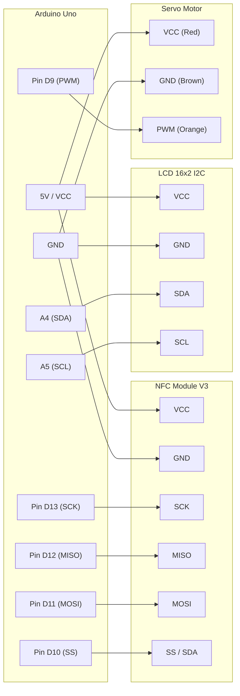

# parking-system

> Sistem parkir otomatis berbasis IoT yang mengintegrasikan teknologi RFID/NFC, mikrokontroler, dan aktuator servo untuk manajemen akses kendaraan yang aman, efisien, dan real-time.

<div align="center">

[](https://opensource.org/licenses/MIT)
[](https://github.com/topics/iot)
[](https://github.com/saecar/parking-system)

</div>

---

## 🌟 Fitur Utama

- 💳 **Autentikasi Kartu Tanpa Kontak (NFC)**: Validasi akses keluar-masuk kendaraan secara cepat menggunakan modul NFC V3 berbasis UID.
- 🚧 **Kontrol Palang Otomatis**: Integrasi *servo motor* presisi tinggi untuk membuka dan menutup gerbang parkir secara otomatis setelah kartu terverifikasi.
- 📟 **Informasi Visual Real-Time**: Layar LCD (I2C/Parallel) menampilkan status sistem, sisa slot, dan pesan sambutan/peringatan secara langsung.
- 🔄 **Sistem Pemantauan IoT**: Sinkronisasi data status parkir dan log akses kendaraan ke server cloud atau lokal via modul komunikasi.

---

## 🛠 Tech Stack & Komponen

### Bill of Materials (BoM)
| Komponen Hardware | Jumlah | Fungsi Utama |
| :--- | :---: | :--- |
| Arduino Uno (ATmega328P) | 1 | Mikrokontroler utama pengolah logika sistem |
| Modul NFC V3 (PN532 / RC522) | 1 | Pembaca kartu/tag RFID/NFC |
| Motor Servo SG90 / MG996R | 1 | Aktuator penggerak palang pintu parkir |
| Modul LCD 16x2 (dengan I2C) | 1 | Display informasi teks antarmuka pengguna |
| Breadboard & Kabel Jumper | Secukupnya | Media penghubung rangkaian elektronika |
| Power Supply / Adaptor 5V | 1 | Sumber daya stabil untuk sistem mikrokontroler dan servo |

---

## ⚡ Diagram Wiring & Pinout

### Diagram Rangkaian (Mermaid)



### Tabel Pinout & Pengkabelan Lengkap

| Komponen / Sensor | Pin pada Modul | Pin Mikrokontroler (Arduino Uno) | Level Tegangan | Keterangan / Fungsi |
| :--- | :--- | :--- | :--- | :--- |
| **NFC Module V3** | VCC | 5V | 5V | Catu daya modul |
| | GND | GND | 0V | Ground bersama |
| | SCK | Pin 13 | 5V / 3.3V | Serial Clock SPI |
| | MISO | Pin 12 | 5V / 3.3V | Master In Slave Out SPI |
| | MOSI | Pin 11 | 5V / 3.3V | Master Out Slave In SPI |
| | SS / SDA | Pin 10 | 5V / 3.3V | Slave Select SPI |
| **LCD 16x2 I2C** | VCC | 5V | 5V | Catu daya modul LCD |
| | GND | GND | 0V | Ground bersama |
| | SDA | Pin A4 (SDA) | 5V | Jalur Data I2C |
| | SCL | Pin A5 (SCL) | 5V | Jalur Clock I2C |
| **Motor Servo** | VCC (Merah) | External 5V / 5V Vin | 5V | Catu daya motor servo |
| | GND (Cokelat) | GND | 0V | Ground bersama |
| | PWM (Oranye) | Pin 9 | 5V (PWM) | Kontrol sudut posisi palang |

---

## 🚀 Cara Pemasangan & Persiapan

Ikuti langkah-langkah di bawah ini untuk menyiapkan lingkungan pengembangan (*development environment*) dan mengunggah kode sumber ke mikrokontroler.

### 1. Kloning Repositori
Buka terminal atau command prompt Anda, lalu jalankan perintah berikut:
```bash
git clone https://github.com/saecar/parking-system.git
cd parking-system
```

### 2. Membuka Proyek
Anda dapat menggunakan **PlatformIO (VS Code)** atau **Arduino IDE**. 

#### Opsi A: Menggunakan PlatformIO (Direkomendasikan)
1. Buka aplikasi *Visual Studio Code*.
2. Install ekstensi **PlatformIO IDE** melalui menu Extensions.
3. Buka folder `parking-system` melalui `File > Open Folder...`.
4. PlatformIO akan otomatis membaca konfigurasi `platformio.ini` dan mendownload dependensi library yang dibutuhkan.

#### Opsi B: Menggunakan Arduino IDE
1. Buka aplikasi *Arduino IDE*.
2. Buka file utama proyek `src/parking-system.ino` (atau buat file baru dan salin kode dari repositori).
3. Install library berikut melalui *Library Manager* (`Ctrl+Shift+P` / *Tools > Manage Libraries*):
   - `Servo` (bawaan Arduino)
   - `LiquidCrystal_I2C` oleh Frank de Brabander
   - `Adafruit PN532` atau library yang kompatibel dengan *NFC Module V3*.

### 3. Kompilasi dan Upload Firmware

#### Menggunakan PlatformIO CLI:
```bash
# Melakukan kompilasi kode (Build)
pio run

# Mengunggah firmware ke Arduino Uno (Upload)
pio run -t upload

# Membuka Serial Monitor untuk memantau log sistem (Baud rate: 115200)
pio device monitor -b 115200
```

#### Menggunakan Arduino IDE:
1. Hubungkan Arduino Uno ke komputer menggunakan kabel USB.
2. Pilih tipe board: **Tools > Board > Arduino AVR Boards > Arduino Uno**.
3. Pilih port serial yang sesuai pada menu **Tools > Port**.
4. Klik tombol **Upload** (ikon panah kanan) pada jendela Arduino IDE.
5. Buka **Serial Monitor** (ikon kaca pembesar di pojok kanan atas) dan atur *baud rate* ke `115200`.

---

## 📂 Struktur Folder

```text
parking-system/
├── .github/
│   └── workflows/          # Konfigurasi CI/CD (jika ada)
├── include/                # File header tambahan (jika ada)
├── lib/                    # Library kustom eksternal
├── src/
│   └── main.cpp            # Kode sumber utama mikrokontroler (Firmware)
├── test/                   # File pengujian unit / integrasi hardware
├── platformio.ini          # Konfigurasi workspace PlatformIO
└── README.md               # Dokumentasi proyek
```

---

## 💡 Tips Troubleshooting Hardware

- **Layar LCD Tidak Menampilkan Teks**: Periksa kembali alamat I2C modul LCD Anda (umumnya `0x27` atau `0x3F`). Anda dapat menjalankan skrip *I2C Scanner* untuk mendeteksi alamat yang benar.
- **Motor Servo Bergetar atau Tidak Bergerak**: Pastikan suplai daya eksternal 5V untuk servo terpisah atau memiliki kapasitas arus yang memadai (minimal 1A-2A), karena pin 5V Arduino sering kali tidak cukup kuat untuk menyuplai beban motor servo secara optimal.
- **Modul NFC Tidak Mendeteksi Kartu**: Periksa kembali jalur komunikasi SPI (SCK, MISO, MOSI, SS) dan pastikan level tegangan logika sudah sesuai (kebanyakan modul bekerja di 3.3V namun toleran terhadap 5V, atau gunakan *logic level converter* jika diperlukan).

---

## 🤝 Kontribusi & Lisensi

Kontribusi, *issue*, dan *pull request* sangat diterima dengan terbuka! Jika Anda memiliki saran untuk meningkatkan sistem parkir ini, silakan buat *issue* baru atau ajukan *pull request*.

Proyek ini dilisensikan di bawah lisensi **MIT** - lihat file [LICENSE](LICENSE) untuk detail lebih lanjut.