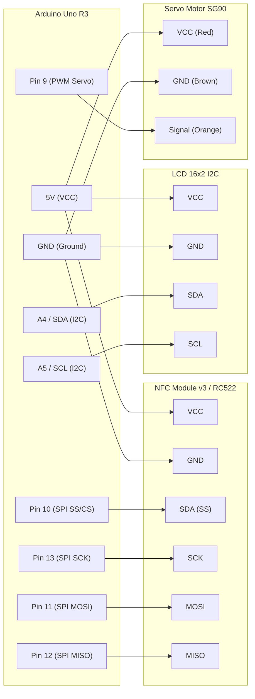

# parking-system

> Sistem parkir otomatis berbasis IoT yang mengintegrasikan teknologi RFID/NFC, kontrol gerbang servo, dan tampilan LCD untuk manajemen akses kendaraan yang aman, efisien, dan real-time.

<div align="center">

[](https://opensource.org/licenses/MIT)
[](https://github.com/topics/iot)
[](https://www.arduino.cc/)
[](https://github.com/saecar/parking-system/topics)

</div>

---

## 🌟 Fitur Utama

- 🚗 **Autentikasi Kendaraan Berbasis NFC**: Membaca kartu/tag RFID/NFC secara instan untuk validasi akses masuk dan keluar area parkir.
- 🚧 **Kontrol Otomatis Palang Pintu**: Menggunakan aktuator Servo Motor yang membuka dan menutup secara otomatis setelah kartu terverifikasi.
- 📟 **Informasi Real-Time (LCD)**: Menampilkan status sistem, sisa slot parkir, dan pesan sapaan/peringatan langsung pada layar LCD I2C.
- ⚡ **Desain Efisien & Modular**: Dibangun di atas mikrokontroler Arduino Uno dengan skema perkawatan *breadboard* yang rapi dan mudah direplikasi.
- 🔌 **Ready for IoT Extension**: Struktur kode yang siap dihubungkan dengan modul ESP8266/ESP32 untuk sinkronisasi data ke *cloud database*.

---

## 🛠 Tech Stack & Komponen

### Bill of Materials (BoM)
| No | Komponen / Hardware | Jumlah | Keterangan / Spesifikasi |
|----|---------------------|--------|--------------------------|
| 1 | Arduino Uno R3 | 1 pcs | Mikrokontroler Utama (ATmega328P) |
| 2 | NFC Module v3 / RFID RC522 | 1 pcs | Modul pembaca kartu 13.56MHz / 13.5MHz |
| 3 | Servo Motor (SG90 / MG996R) | 1 pcs | Aktuator penggerak palang parkir |
| 4 | LCD 16x2 with I2C Module | 1 pcs | Layar informasi teks (SCL/SDA) |
| 5 | Breadboard & Jumper Wires | Secukupnya | Media perangkaian sirkuit (Male-to-Male, Male-to-Female) |
| 6 | Power Supply Eksternal 5V | 1 pcs | Opsional (untuk kestabilan daya servo) |

### 📊 Diagram Wiring Interaktif



### Tabel Pinout Lengkap

| Nama Komponen | Pin Modul/Sensor | Pin Mikrokontroler | Level Tegangan | Keterangan / Fungsi |
|---------------|------------------|-------------------|----------------|---------------------|
| **LCD 16x2 I2C** | VCC | 5V | 5V | Catu daya modul LCD |
| | GND | GND | 0V | Ground bersama |
| | SDA | A4 (SDA) | 5V | Jalur data I2C |
| | SCL | A5 (SCL) | 5V | Jalur clock I2C |
| **NFC Module v3**| VCC | 3.3V / 5V | 3.3V/5V* | Catu daya RFID/NFC *(sesuaikan modul)* |
| | GND | GND | 0V | Ground bersama |
| | SDA (SS) | Pin 10 | 5V | SPI Chip Select |
| | SCK | Pin 13 | 5V | SPI Serial Clock |
| | MOSI | Pin 11 | 5V | SPI Master Out Slave In |
| | MISO | Pin 12 | 5V | SPI Master In Slave Out |
| **Servo Motor** | VCC (Merah) | 5V / Eksternal | 5V | Daya motor servo |
| | GND (Cokelat) | GND | 0V | Ground motor servo |
| | Signal (Oranye)| Pin 9 | 5V (PWM) | Kontrol sudut posisi palang |

---

## 🚀 Cara Pemasangan & Persiapan

Ikuti langkah-langkah di bawah ini untuk menyiapkan lingkungan pengembangan (*development environment*) dan mengunggah kode ke Arduino Uno.

### 1. Kloning Repositori
Buka terminal/command prompt pada komputer Anda, lalu jalankan perintah berikut:
```bash
git clone https://github.com/saecar/parking-system.git
cd parking-system
```

### 2. Instalasi Dependensi (Libraries)
Pastikan Anda telah memasang pustaka (*libraries*) berikut melalui **Arduino Library Manager** atau **PlatformIO Library Dependencies**:
- `MFRC522` (atau driver NFC Module v3 yang kompatibel)
- `LiquidCrystal_I2C`
- `Servo`

### 3. Konfigurasi dan Upload Firmware

#### Opsi A: Menggunakan Arduino IDE
1. Buka aplikasi **Arduino IDE**.
2. Pilih menu `File > Open` lalu arahkan ke file utama proyek (`parking-system.ino`).
3. Sambungkan Arduino Uno ke komputer menggunakan kabel USB.
4. Pilih board pada menu `Tools > Board > Arduino AVR Boards > Arduino Uno`.
5. Pilih port serial yang aktif pada menu `Tools > Port`.
6. Klik tombol **Upload** (ikon panah kanan) untuk mengompilasi dan mengunggah kode ke mikrokontroler.
7. Buka **Serial Monitor** (`Ctrl + Shift + M`) dengan baud rate `9600` atau `115200` untuk memantau status sistem.

#### Opsi B: Menggunakan PlatformIO (VS Code)
1. Pastikan ekstensi **PlatformIO IDE** terpasang di Visual Studio Code Anda.
2. Buka folder proyek `parking-system` di VS Code.
3. Jalankan perintah build dan upload melalui Terminal PlatformIO:
   ```bash
   pio run
   pio run -t upload
   ```
4. Pantau log perangkat menggunakan Serial Monitor bawaan PlatformIO:
   ```bash
   pio device monitor --baud 9600
   ```

---

## 📂 Struktur Folder

```text
parking-system/
├── .github/              # Konfigurasi GitHub & workflow
├── docs/                 # Dokumentasi tambahan & skema gambar
├── firmware/             # Kode sumber utama mikrokontroler
│   ├── parking-system.ino# Berkas program utama Arduino
│   └── config.h          # File konfigurasi pin dan parameter
├── breadboard/           # Skema diagram fisik dan layout
├── platformio.ini        # Konfigurasi project untuk PlatformIO
├── LICENSE               # Lisensi perangkat lunak (MIT)
└── README.md             # Dokumentasi proyek (Anda di sini)
```

---

## 💡 Tips Troubleshooting Hardware

- **LCD Tidak Menampilkan Teks (Blank/Kotak Hitam)**: 
  Putar potensiometer kontras di bagian belakang modul I2C. Pastikan alamat I2C LCD sudah benar (umumnya `0x27` atau `0x3F`). Jalankan skrip *I2C Scanner* jika ragu.
- **Modul NFC/RFID Tidak Mendeteksi Kartu**: 
  Periksa kembali koneksi jalur SPI (MOSI, MISO, SCK, SS). Pastikan suplai tegangan 3.3V/5V stabil dan tidak mengalami *voltage drop* saat modul diaktifkan.
- **Servo Bergerak Tersendat-sendat (Jitter)**: 
  Kekurangan arus pada pin 5V Arduino Uno sering menjadi penyebab utama. Disarankan menggunakan catu daya eksternal 5V terpisah untuk motor servo dengan catatan kabel GND tetap disatukan (*common ground*).

---

## 🤝 Kontribusi & Lisensi

Kontribusi, *issue*, dan *pull request* sangat terbuka dan dipersilakan! 

1. Fork repositori ini.
2. Buat *branch* fitur baru (`git checkout -b feature/FiturBaru`).
3. Lakukan *commit* perubahan (`git commit -m 'Menambahkan fitur baru X'`).
4. Dorong ke *branch* tersebut (`git push origin feature/FiturBaru`).
5. Ajukan *Pull Request*.

Proyek ini dilisensikan di bawah lisensi **MIT**. Sil