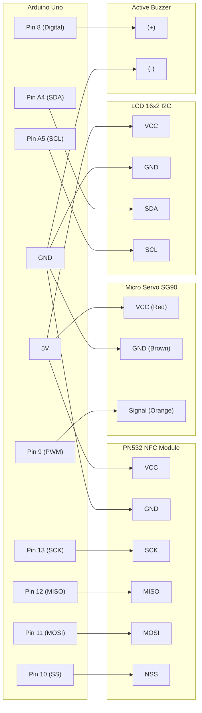

# Secure Door Parking System

> Secure Door Parking System adalah sistem palang pintu parkir otomatis berbasis IoT menggunakan Arduino Uno, sensor NFC, dan motor servo yang dilengkapi sistem keamanan terintegrasi untuk mengontrol akses kendaraan secara efisien.

<p align="center">
  <a href="https://github.com/saecar/secure-door-parking/blob/main/LICENSE"></a>
  <a href="https://github.com/saecar/secure-door-parking/topics/iot"></a>
  <a href="https://github.com/saecar/secure-door-parking"></a>
  <a href="https://github.com/saecar/secure-door-parking"></a>
</p>

---

## 🌟 Fitur Utama

- 💳 **Autentikasi NFC/RFID**: Menggunakan modul Elechouse PN532 dengan protokol SPI untuk pembacaan kartu akses yang cepat, stabil, dan aman.
- 🚪 **Gerakan Palang Halus (Smooth Motion)**: Kontrol motor servo SG90 secara bertahap untuk mencegah hentakan mekanis pada palang pintu.
- 🛜 **Real-time LCD Display**: Layar 16x2 I2C memberikan informasi status sistem secara langsung (akses diterima, ditolak, dan *countdown* waktu tutup otomatis).
- 🚨 **Sistem Pengaman Anti-Brute-Force**: Fitur *lockout* otomatis selama 10 detik jika terjadi 3 kali percobaan gagal pemindaian kartu berturut-turut.
- 🔊 **Indikator Audio Interaktif**: Buzzer aktif dengan nada berbeda untuk membedakan status akses (diterima, ditolak, dan palang kembali terkunci).

---

## 🛠 Tech Stack & Komponen

### Bill of Materials (BoM)
| Komponen | Jumlah | Fungsi Utama |
| :--- | :---: | :--- |
| **Arduino Uno** | 1 | Mikrokontroler utama pemroses logika program |
| **Elechouse NFC Module V3 (PN532)** | 1 | Pembaca kartu/tag NFC berbasis SPI |
| **Micro Servo SG90** | 1 | Penggerak mekanis palang pintu parkir |
| **LCD 16x2 + I2C Backpack (PCF8574)** | 1 | Menampilkan antarmuka pengguna (UI) status sistem |
| **Active Buzzer** | 1 | Memberikan feedback suara/audio |
| **Kabel Jumper (Male-to-Male, Male-to-Female)** | Secukupnya | Jalur interkoneksi rangkaian elektronika |
| **Power Supply / Kabel USB** | 1 | Catu daya perangkat (5V) |

---

## 📐 Skema Rangkaian & Pinout (Wiring Diagram)



### Tabel Pinout Lengkap
| Komponen | Pin Modul / Sensor | Pin Mikrokontroler | Level Tegangan | Keterangan |
| :--- | :--- | :--- | :--- | :--- |
| **PN532 NFC** | VCC | 5V | 5V | Catu daya modul NFC |
| | GND | GND | 0V | Ground bersama |
| | SCK | Pin 13 | 5V | SPI Serial Clock |
| | MISO | Pin 12 | 5V | SPI Master In Slave Out |
| | MOSI | Pin 11 | 5V | SPI Master Out Slave In |
| | NSS / SS | Pin 10 | 5V | SPI Slave Select |
| **Servo SG90** | Signal (Orange) | Pin 9 (PWM) | 5V | Kontrol sudut posisi palang |
| | VCC (Red) | 5V | 5V | Catu daya motor |
| | GND (Brown) | GND | 0V | Ground bersama |
| **LCD 16x2 I2C** | VCC | 5V | 5V | Catu daya modul I2C |
| | GND | GND | 0V | Ground bersama |
| | SDA | Pin A4 | 5V | Jalur Data I2C |
| | SCL | Pin A5 | 5V | Jalur Clock I2C |
| **Buzzer** | (+) | Pin 8 | 5V | Output sinyal nada audio |
| | (-) | GND | 0V | Ground bersama |

---

## 🚀 Cara Pemasangan & Persiapan

Ikuti langkah-langkah di bawah ini untuk merakit dan mengunggah *firmware* ke Arduino Uno:

### 1. Persiapan Perangkat Lunak
Pastikan Anda telah menginstal software berikut di komputer Anda:
- [Arduino IDE](https://www.arduino.cc/en/software) (Versi 1.8.19 atau lebih baru / Arduino IDE 2.x)
- Library Dependencies (Install melalui Library Manager Arduino IDE):
  - `Adafruit PN532` (oleh Adafruit)
  - `LiquidCrystal_I2C` (oleh Frank de Brabander)
  - `Servo` (bawaan / *built-in*)

### 2. Kloning Repositori
Buka terminal atau command prompt, lalu jalankan perintah berikut:
```bash
git clone https://github.com/saecar/secure-door-parking.git
cd secure-door-parking
```

### 3. Merakit Hardware
1. Hubungkan modul **PN532 NFC** ke Arduino Uno menggunakan mode **SPI** sesuai dengan tabel pinout di atas.
2. Sambungkan kabel sinyal **Servo SG90** ke pin digital PWM **9**.
3. Hubungkan modul **I2C LCD** ke pin analog **A4 (SDA)** dan **A5 (SCL)**.
4. Pasang **Buzzer** dengan kutub positif ke pin digital **8** dan negatif ke **GND**.
5. Pastikan semua jalur daya (VCC dan GND) tersambung dengan benar sebelum mencolokkan kabel USB.

### 4. Unggah Firmware (Upload)
1. Sambungkan Arduino Uno ke komputer menggunakan kabel USB.
2. Buka file proyek `secure_door.ino` menggunakan Arduino IDE.
3. Pilih jenis board: **Tools > Board > Arduino AVR Boards > Arduino Uno**.
4. Pilih port komunikasi yang sesuai: **Tools > Port > (COMx / /dev/ttyUSB0)**.
5. Klik tombol **Upload** (ikon panah kanan) pada Arduino IDE untuk mengompilasi dan mengunggah kode ke mikrokontroler.
6. Buka **Serial Monitor** (Ctrl + Shift + M) pada baud rate `115200` untuk memantau log sistem secara langsung.

---

## 📂 Struktur Folder

```text
secure-door-parking/
│
├── firmware/
│   └── secure_door.ino       # Kode sumber utama mikrokontroler C++
├── schematics/
│   └── wiring_diagram.png    # Dokumentasi visual rangkaian hardware
├── .gitignore                # File abaikan Git
├── LICENSE                   # Lisensi open-source proyek (MIT)
└── README.md                 # Dokumentasi resmi proyek
```

---

## 💡 Troubleshooting Umum

- **LCD Tidak Menampilkan Tulisan / Layar Gelap:**
  - Periksa kembali sambungan kabel SDA dan SCL (pastikan tidak terbalik).
  - Sesuaikan potensiometer kontras pada modul backpack I2C atau pastikan alamat I2C sudah benar (umumnya `0x27` atau `0x3F`).
- **Modul NFC Tidak Terdeteksi:**
  - Pastikan saklar *DIP Switch* pada modul PN532 berada pada posisi mode SPI (`SEL0 = OFF`, `SEL1 = ON`).
  - Periksa jalur kabel SPI (SCK, MISO, MOSI, SS) ke pin 13, 12, 11, dan 10 Arduino Uno.
- **Servo Bergetar atau Tidak Bergerak:**
  - Pastikan catu daya 5V dari Arduino mampu menyuplai arus yang cukup untuk motor servo. Jika tidak stabil, gunakan catu daya eksternal (dengan menyatukan ground / *common ground*).

---

## 🤝 Kontribusi & Lisensi

Kontribusi,